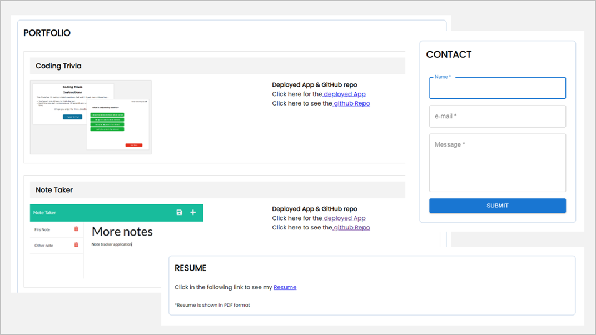

# My Porfolio (React)  

## Table of Contents
- [Description](#description)
  

## Description  

My Portfolio (React)

Is a simple Bio app developed in react.js in which ther are 2 fixed sections, header and footer, and a dynamic rendered section that depends of the option selected from the Nav Bar.
  

Sections:
- About Me: Brief Bio Description
- Projects: List of 5 proyects with their corresponding url and github repo
- Contact: Contact form so user can be contacted (In development)
- Resuem: Link to resume in PDF format

  

## Questions
Please refer to my GitHub profile for more information: https://github.com/lalo79  
If you have questions, you can reach me via e-mail: epacheco.leines@gmail.com   

